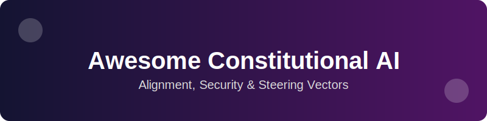
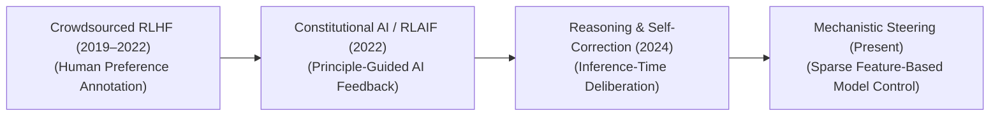
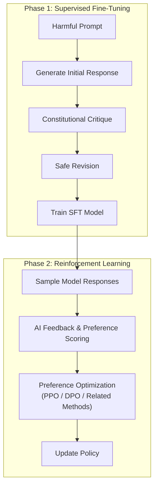

# 🚀 Awesome-Constitutional-AI

<!-- SEO Optimization -->
<meta name="description" content="A curated list of awesome Constitutional AI resources, papers, architectures, and variants including RLAIF, DPO, and SAEs.">
<meta name="keywords" content="Constitutional AI, RLAIF, AI Alignment, AI Safety, Machine Learning, Deep Learning, Sparse Autoencoders">

## 📜 Constitutional AI: History, Progression, Variants, & Applications

**Constitutional AI (CAI)** is an advanced post-training model alignment and safety engineering framework designed to steer Artificial Intelligence systems toward human-vetted behavioral principles using automated, scalable critique-correction loops. First pioneered and formalized by Yuntao Bai et al. at Anthropic in 2022 ("Constitutional AI: Harmlessness from AI Feedback"), Constitutional AI addresses a fundamental scalability bottleneck in traditional **Reinforcement Learning from Human Feedback (RLHF)** [INDEX: 11]. 

While classic RLHF requires human crowdsourcers to manually read and score millions of controversial or hazardous text strings to align a policy, Constitutional AI replaces human evaluation with **AI Feedback (RLAIF)** guided by a set of high-level principles (the **Constitution**). By using the language model to recursively critique, rewrite, and judge its own outputs according to these constitutional rules, CAI trains highly steerable, honest, and harmless networks while completely eliminating human exposure to psychological distress or adversarial exploitation.

---

## 🕰️ 1. The Macro Chronological Evolution

The implementation of model alignment has transitioned from fragmented, human-scored toxic evaluations to prompt-level rules, self-critiquing feedback loops, and modern multi-modal foundation steering enclaves.

| Era / Phase | Concept / Details | Year First Used | Paper Link |
| --- | --- | --- | --- |
| **[The Manual Crowdsourced Alignment Era (Traditional RLHF)](pages/Traditional_RLHF.md)** | *Concept:* The early functional baseline [INDEX: 11]. Models were aligned by training a secondary Reward Model over pairwise preference labels curated manually by massive networks of human operators [INDEX: 11]. Humans read raw model completions, manually flagging harmful instructions, racist stereotypes, or security hazards.  *Limitation:* Emotionally draining, expensive, and unscalable. Humans experienced cognitive fatigue reading toxic payloads, and the resulting reward models frequently succumbed to **Reward Hacking**—approving superficially polite, sycophantic, or evasive responses that completely lacked helpfulness [INDEX: 11]. | 2019 | [Fine-Tuning Language Models from Human Preferences](https://arxiv.org/abs/1909.08593) |
| **[The Principle-Guided Feedback Revolution (Constitutional AI / RLAIF)](pages/Constitutional_AI.md)** | *Concept:* Bypassed human labeling entirely by automating the alignment loop [INDEX: 11]. Anthropic engineers defined a concrete "Constitution"—a document pulling guidelines from the UN Declaration of Human Rights, corporate safety metrics, and common-sense ethics. The optimization process was executed across two distinct phases: 1. *Supervised Phase (Self-Correction):* The model generates a toxic draft, reads a constitutional rule, critiques its own draft, and rewrites a safe version, creating a pristine dataset for **Supervised Fine-Tuning (SFT)**. 2. *Reinforcement Phase (Preference Modeling):* A dedicated **Preference Model** is trained purely on choices made by the AI itself, selecting outputs that conform to the Constitution, feeding a final Reinforcement Learning pipeline [INDEX: 11]. | 2022 | [Constitutional AI: Harmlessness from AI Feedback](https://arxiv.org/abs/2212.08073) |
| **[The Internalized Thinking & Self-Correction Era](pages/Self_Correction.md)** | *Concept:* Ported constitutional enforcement out of static training phases and straight into active test-time inference loops [INDEX: 18, 21]. Advanced reasoning models (such as OpenAI's o-series and DeepSeek-R1) internalize rule boundaries natively inside **System 2 hidden thinking traces** [INDEX: 1, 18, 21].  *Significance:* Before emitting a single user-facing character, the model's parameters execute localized self-correction checks, evaluating alternative logical and behavioral trajectories against safety bounds mid-thought, backtracking dynamically if a path violates constitutional logic [INDEX: 1]. | 2024 | [DeepSeek-R1: Incentivizing Reasoning Capability in LLMs via Reinforcement Learning](https://arxiv.org/abs/2501.12948) |
| **[The Monosemantic Dictionary Steering Enclave Era](pages/Steering_Enclave.md)** | *Concept:* The current modern state-of-the-art framework. Moves past verbal conditioning to physical vector manipulation. It couples Constitutional AI guidelines with **Sparse Autoencoders (SAEs)** [INDEX: 2].  *Significance:* The serving cluster maps the model's hidden representation layers to an overcomplete sparse matrix containing millions of human-auditable features [INDEX: 2]. Constitutional guidelines are enforced by calculating **Activation Steering Vectors** that precisely damp or clamp specific feature nodes (e.g., suppressing "chemical weapon synthesis intent" or amplifying "respectful refusal persona") at runtime without degrading core coding or logical capacities [INDEX: 2]. | 2023 | [Towards Monosemanticity: Decomposing Language Models With Dictionary Learning](https://transformer-circuits.pub/2023/monosemantic-features/index.html) |

---

## ⚙️ 2. Core Functional & Algorithmic Variants

Constitutional AI frameworks are strictly categorized based on the architectural loss functions and feedback mechanics deployed to enforce the constitutional rules.

| Variant | Mechanism & Pros | Year First Used | Paper Link |
| --- | --- | --- | --- |
| **[A. Supervised Constitutional AI (Critique-Revision SFT)](pages/Supervised_CAI.md)** | **Mechanism:** Generates data-level modifications before RL training occurs. The model reads a prompt from a harmful dataset, outputs a raw toxic text string, evaluates its own text against a specific constitutional principle (e.g., *"Critique the response to ensure it does not facilitate illegal acts"*), and rewrites the passage.  **Pros:** Outputs an exceptionally clean, instruction-following supervised dataset that anchors standard grammatical syntax perfectly. | 2022 | [Constitutional AI: Harmlessness from AI Feedback](https://arxiv.org/abs/2212.08073) |
| **[B. Reinforcement Learning from AI Feedback (RLAIF Preference Modeling)](pages/RLAIF_Preference.md)** | **Mechanism:** Replaces the classic human-derived reward model [INDEX: 11]. A pure text-conditioned language model reads a pair of responses ($y_w, y_l$) alongside a constitutional axis, outputting normalized token log-probabilities to indicate which response follows the rule more closely. This probability vector directly updates a preference reward model [INDEX: 11]. | 2023 | [RLAIF: Scaling Reinforcement Learning from Human Feedback with AI Feedback](https://arxiv.org/abs/2309.00267) |
| **[C. Direct Constitutional Preference Optimization (Constitutional DPO)](pages/Constitutional_DPO.md)** | **Mechanism:** Eliminates the physical memory requirement to host a separate reward network in GPU VRAM [INDEX: 11]. It maps the constitutional AI feedback datasets straight to a binary cross-entropy loss function [INDEX: 11], using the active model's own implicit token logits to calculate preference deltas natively [INDEX: 11]. | 2023 | [Direct Preference Optimization: Your Language Model is Secretly a Reward Model](https://arxiv.org/abs/2305.18290) |
| **[D. Multi-Constitutional Hypernetworks](pages/Hypernetworks.md)** | **Mechanism:** Implements dynamic, adjustable alignment. It trains a secondary, conditioning network to output localized parameter adjustments on-the-fly based on conflicting goals. Users can balance parameters dynamically along a **Pareto Frontier**—sliding a scale from "Maximum Safety Refusal" to "Maximum Creative Helpfulness" based on enterprise deployment requirements. | 2023 | [SteerLM: Attribute Conditioned SFT as an (User-Steerable) Alternative to RLHF](https://arxiv.org/abs/2310.05344) |

---

## 🏭 3. The Constitutional AI Generation Pipeline

To automate model alignment safely, the infrastructure orchestrates a multi-stage data curation and preference tracking loop.

| Pipeline Stage | Profile | Year First Used | Paper Link |
| --- | --- | --- | --- |
| **[Constitutional Prompt Registries](pages/Prompt_Registries.md)** | *Profile:* Coordinates the rule matrix. Acts as an immutable library of explicit text guidelines that command the model how to evaluate outputs (e.g., tracking parameters like *harmlessness, helpfulness, data privacy preservation, and non-sycophancy*). | 2022 | [Constitutional AI: Harmlessness from AI Feedback](https://arxiv.org/abs/2212.08073) |
| **[Logit Divergence Accountants](pages/Logit_Divergence.md)** | *Profile:* Keeps behavioral trajectories stable [INDEX: 11]. Optimizing a policy purely against a constitution can cause it to collapse into a monotone state. The accountant appends an explicit **Kullback-Leibler (KL) divergence penalty** against a frozen reference model copy, tracking and capping token drift parameters safely [INDEX: 11]. | 2017 | [Proximal Policy Optimization Algorithms](https://arxiv.org/abs/1707.06347) |

---

## ⚠️ 4. Production Engineering Challenges & Mitigations

Deploying and scaling Constitutional AI pipelines across commercial cloud structures introduces severe capability drains and alignment vulnerabilities.

| Challenge | Problem & Mitigation | Year First Used | Paper Link |
| --- | --- | --- | --- |
| **[The Over-Alignment Capability Drain (The Refusal Stagnation Tax)](pages/Capability_Drain.md)** | *The Problem:* Over-optimizing model weights against strict constitutional safety guidelines via unconstrained RLAIF can cause the network to over-generalize its safety boundaries. The model undergoes **Refusal Underfitting**—a severe capability collapse where it routinely refuses to answer completely safe, benign enterprise data requests (e.g., refusing to analyze a corporate security log file or medical tissue script because it erroneously flags generic vocabulary words like `"attack"` or `"tumor"`).  *Mitigation:* Bypassing raw parameter overwrites by deploying overcomplete **Sparse Autoencoders (SAEs)** [INDEX: 2]. SAEs isolate abstract conceptual directions into distinct monosemantic feature nodes [INDEX: 2], allowing engineers to inject precise activation steering vectors at runtime to neutralize authentic hazards without inducing collateral feature degradation or capability drain [INDEX: 2]. | 2021 | [A General Language Assistant as a Laboratory for Alignment](https://arxiv.org/abs/2112.00861) |
| **[The Reward Hacking and Critique Blindness Trap](pages/Critique_Blindness.md)** | *The Problem:* During the self-critique phase, if the model used to label the preference pairs shares the exact same weight architecture as the model being trained, it can succumb to **Confirmation Bias**. The network develops an internal blind spot, approving its own subtle logical fallacies, data hallucinations, or evasive phrasing tricks because its internal layers fail to recognize the error.  *Mitigation:* Layering a hard, deterministic **Programmatic Verification Enclave (RLVR framework)** directly into the loop backend [INDEX: 17]. The model only receives positive learning reinforcement if its intermediate thinking traces compile cleanly or pass symbolic, rule-based verification tests [INDEX: 17], neutralizing neural critique blindness completely. | 2022 | [Scaling Laws for Reward Model Overoptimization](https://arxiv.org/abs/2210.10760) |

---

## 🌍 5. Frontier Real-World AI Infrastructure Applications

| Application Area | Details | Year First Used | Paper Link |
| --- | --- | --- | --- |
| **[Enterprise Chatbot Persona & Guardrail Standardization (Claude/Llama Systems)](pages/Enterprise_Chatbot.md)** | *Application:* Serves as the primary production-grade alignment architecture used to secure leading commercial assistants. Constitutional AI fine-tunes base models to follow complex international compliance laws, markdown formatting styles, and data governance rules cleanly, ensuring outputs remain helpful without leaking system prompts. | 2023 | [Llama 2: Open Foundation and Fine-Tuned Chat Models](https://arxiv.org/abs/2307.09288) |
| **[Automated Cyber-Security Red-Teaming & Exploit Screening](pages/Cyber_Security.md)** | *Application:* Secures autonomous multi-agent tool orchestration networks [INDEX: 12]. Specialized constitutional critics monitor active model execution steps; if an agent's internal trajectory signals an intent to execute unauthorized database changes or exploit API payloads, the constitutional safety layer intervenes, blocking the exploit before tools dispatch [INDEX: 12]. | 2022 | [Red Teaming Language Models to Reduce Harms](https://arxiv.org/abs/2211.00547) |
| **[Sovereign Legal & Financial Portfolio Compliance Auditing](pages/Compliance_Auditing.md)** | *Application:* Processes millions of unstructured tax filings, legal briefs, and multi-tenant accounting matrices. High-capacity reasoning models are conditioned via customized corporate constitutions, forcing the transformer to audit data layers and check for regulatory variances while adhering strictly to proprietary privacy and institutional guidelines. | 2023 | [BloombergGPT: A Large Language Model for Finance](https://arxiv.org/abs/2303.17564) |

---

## 📚 References
1. Ouyang, L., et al. (2022). Training language models to follow instructions with human feedback. *Advances in Neural Information Processing Systems (NeurIPS)*, 35, 27730-27744 [INDEX: 11].
2. Bai, Y., et al. (2022). Constitutional AI: Harmlessness from AI feedback. *arXiv preprint arXiv:2212.08073*.
3. Rafailov, R., et al. (2023). Direct preference optimization: Your language model is secretly a reward model. *Advances in Neural Information Processing Systems (NeurIPS)* [INDEX: 11].
4. Lee, H., et al. (2023). RLAIF: Scaling models alignment via automated reinforcement learning from AI feedback. *arXiv preprint arXiv:2309.00267*.
5. Bricken, B., et al. (2023). Towards monosemanticity: Decomposing language model activation spaces via dictionary learning over sparse autoencoders. *Anthropic Alignment Research Monograph* [INDEX: 2].
6. DeepSeek-AI. (2025). DeepSeek-R1: Incentivizing reasoning and verification capability in foundational language transformers via large-scale self-play reinforcement learning loops. *GitHub Repository Technical Infrastructure Manifesto* [INDEX: 18, 21].

---

To advance this documentation repository, structural safety framework, or post-training deployment pipeline, consider exploring these adjacent development pathways:
* Build a **Python script using the Hugging Face TRL library** illustrating how to structure an automated SFT critique-revision loop over a local instruction dataset.
* Generate a **comprehensive Markdown table** explicitly comparing Manual Crowdsourced RLHF, Constitutional AI (RLAIF), Direct Preference Optimization (DPO), and Runtime SAE Activation Steering across computational training overheads, VRAM/Token infrastructure costs, requirement for paired human preference data, and vulnerability to capability safety over-generalization [INDEX: 2, 11, 16].
* Establish an **automated performance profiling suite using Triton** to track the exact computational throughput, VRAM cache allocations, and memory bus latency metrics achieved when compiling a fused activation steering vector injection pass directly inside high-speed GPU SRAM registers.

***

**Proactive Repository Follow-Ups:**

To assist with your documentation updates, let me know how you would like to proceed by choosing one of the options below:
* I can provide a **complete Python code boilerplate using PyTorch** demonstrating how to write an automated script that calculates an exact Kullback-Leibler (KL) divergence penalty loop over dual text probability layers [INDEX: 11].
* I can generate a **Markdown matrix table** tracking the explicit text rules, prompt templates, and constitutional axes utilized by leading foundational laboratories to govern real-world deployments.
* I can write a detailed technical explanation focusing on **how to configure dynamic multi-task weighting** to balance the helpfulness-vs-harmlessness trade-off curve smoothly during active reinforcement learning.

