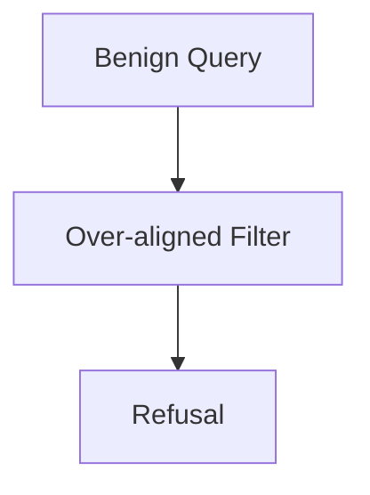

# The Over-Alignment Capability Drain (The Refusal Stagnation Tax)

Strict rules cause refusal underfitting (false positives).

```mermaid
graph TD;
    A[Benign Query] --> B[Over-aligned Filter] --> C[Refusal];
```
