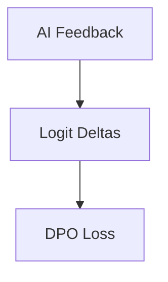

# C. Direct Constitutional Preference Optimization (Constitutional DPO)

Eliminates RM by directly optimizing LM using DPO.

```mermaid
graph TD;
    A[AI Feedback] --> B[Logit Deltas] --> C[DPO Loss];
```
