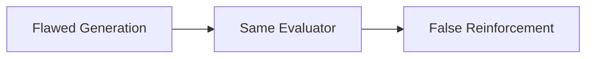

# The Reward Hacking and Critique Blindness Trap

Confirmation bias if same model generates and critiques.

```mermaid
graph LR;
    A[Flawed Generation] --> B[Same Evaluator] --> C[False Reinforcement];
```
