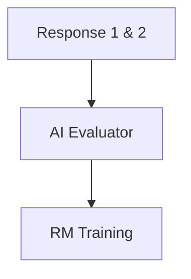

# B. Reinforcement Learning from AI Feedback (RLAIF Preference Modeling)

AI scores pairwise completions to train a Reward Model.

```mermaid
graph TD;
    A[Response 1 & 2] --> C[AI Evaluator] --> D[RM Training];
```
