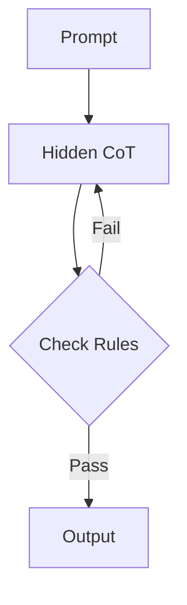

# The Internalized Thinking & Self-Correction Era

Models use systemic reasoning to verify safety natively.

```mermaid
graph TD;
    A[Prompt] --> B[Hidden CoT];
    B --> C{Check Rules};
    C -- Pass --> D[Output];
    C -- Fail --> B;
```
