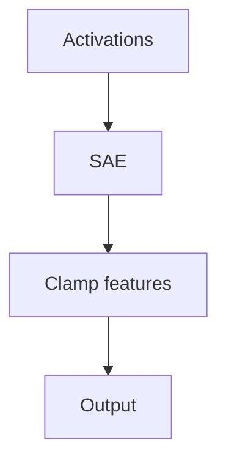

# The Monosemantic Dictionary Steering Enclave Era

Sparse Autoencoders and Steering Vectors clamp concepts directly.

```mermaid
graph TD;
    A[Activations] --> B[SAE];
    B --> C[Clamp features] --> D[Output];
```
