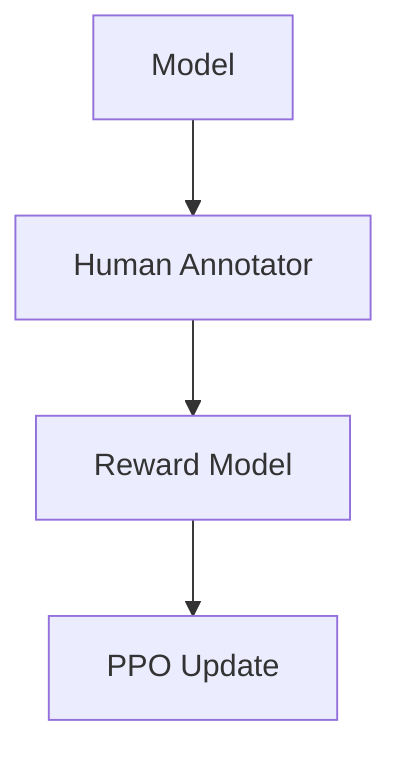

# The Manual Crowdsourced Alignment Era (Traditional RLHF)

Traditional RLHF uses human preference data to train reward models. 

```mermaid
graph TD;
    A[Model] --> B[Human Annotator];
    B --> C[Reward Model];
    C --> D[PPO Update];
```
